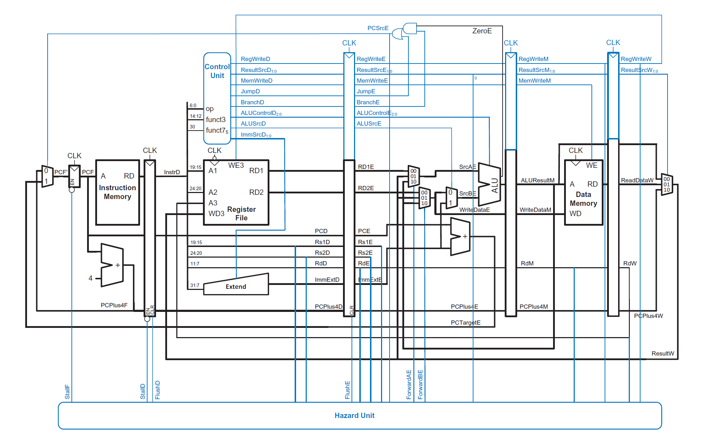

# Pipelined RISC-V Processor Core

A 5-stage pipelined RISC-V processor core implemented in Verilog, with a hazard detection and forwarding unit to resolve data and control hazards across the pipeline.

## Overview

The processor implements the classic 5-stage RISC pipeline:

- **Fetch (IF)** — fetches the next instruction from instruction memory
- **Decode (ID)** — decodes the instruction and reads source registers
- **Execute (EX)** — performs ALU operations and resolves branch targets
- **Memory Access (MEM)** — reads/writes data memory
- **WriteBack (WB)** — writes results back to the register file

Pipeline registers between each stage carry control and data signals forward, and a dedicated hazard unit resolves both data hazards (via forwarding) and control hazards (via branch/PC-redirect logic).

## Architecture



```
pipelined_processor_top
├── fetch : Fetch_Cycle
│   ├── PC_MUX : mux2by1
│   ├── Program_Counter : program_counter
│   ├── Instruction_Memory : instruction_memory
│   └── PC_adder : PC_Adder
│
├── decode : Decode_Cycle
│   ├── control_unit : control_unit_top_mod
│   │   ├── Main_Decoder : main_decoder_mod
│   │   └── ALU_Decoder : alu_decoder
│   ├── register_file : register_file
│   └── sign_extension : sign_extend
│
├── execute : Execute_Cycle
│   ├── srcAE_mux : mux4by1
│   ├── srcBE_mux : mux4by1
│   ├── alu_src_mux : mux2by1
│   ├── alu : ALU
│   └── branch_adder : PC_Adder
│
├── memory : Memory_Cycle
│   └── dmem : data_memory
│
├── WriteBack : WriteBack_Cycle
│   └── result_mux : mux2by1
│
├── Forwarding_block : hazard_unit
│
└── Memory File
    └── memfile.mem
```

### Key components

| Module | Instance | Responsibility |
|---|---|---|
| **Fetch_Cycle** | `fetch` | Fetches instructions; updates PC via `PC_MUX`/`PC_Adder`, reads `instruction_memory` |
| **Decode_Cycle** | `decode` | Decodes instructions, reads `register_file`, sign-extends immediates, generates control signals via `control_unit_top_mod` |
| **control_unit_top_mod** | `control_unit` | Combines `main_decoder_mod` and `alu_decoder` outputs into pipeline control signals |
| **Execute_Cycle** | `execute` | Performs ALU operations (via `alu`), selects forwarded operands (`srcAE_mux`/`srcBE_mux`), computes branch target (`branch_adder`) |
| **Memory_Cycle** | `memory` | Reads/writes `data_memory` |
| **WriteBack_Cycle** | `WriteBack` | Selects the final result (`result_mux`) and writes it back to the register file |
| **hazard_unit** | `Forwarding_block` | Detects data hazards and generates forwarding selects (ForwardAE/ForwardBE); detects control hazards from taken branches |

## Hazard Handling

- **Data hazards**: Resolved via ALU operand forwarding from the EX/MEM and MEM/WB pipeline stages, selected using 2-bit forwarding control signals (`ForwardAE`, `ForwardBE`) feeding the `srcAE_mux`/`srcBE_mux` 4-to-1 muxes in Execute_Cycle.
- **Control hazards**: Resolved via branch/PC-redirect logic — when a branch is taken in the Execute stage (`PCSrcE`), the Fetch stage's `PC_MUX` is redirected to the computed branch target (`PCTargetE`).

## Verification

Functional correctness was verified by loading RISC-V programs (`memfile.mem`) into instruction memory and executing them in simulation, analyzing waveforms in Vivado to confirm correct pipeline behavior (register writes, memory accesses, and branch redirection) across all five stages.

## Tools

- **Simulator / Synthesis:** Xilinx Vivado
- **Language:** Verilog

## Repository Structure

```
├── rtl/
│   ├── pipelined_processor_top.v
│   ├── Fetch_Cycle.v
│   ├── mux2by1.v
│   ├── program_counter.v
│   ├── instruction_memory.v
│   ├── PC_Adder.v
│   ├── Decode_Cycle.v
│   ├── control_unit_top_mod.v
│   ├── main_decoder_mod.v
│   ├── alu_decoder.v
│   ├── register_file.v
│   ├── sign_extend.v
│   ├── Execute_Cycle.v
│   ├── mux3by1.v
│   ├── ALU.v
│   ├── Memory_Cycle.v
│   ├── data_memory.v
│   ├── WriteBack_Cycle.v
│   └── hazard_unit.v
├── sim/
│   └── memfile.mem
├── docs/
│   └── architecture.png
└── README.md
```

## Author

**Stephen Tagoe**
[GitHub](https://github.com/Stevederoyal) | [LinkedIn](https://linkedin.com/in/stephen-tagoe-7588a61b7/)
